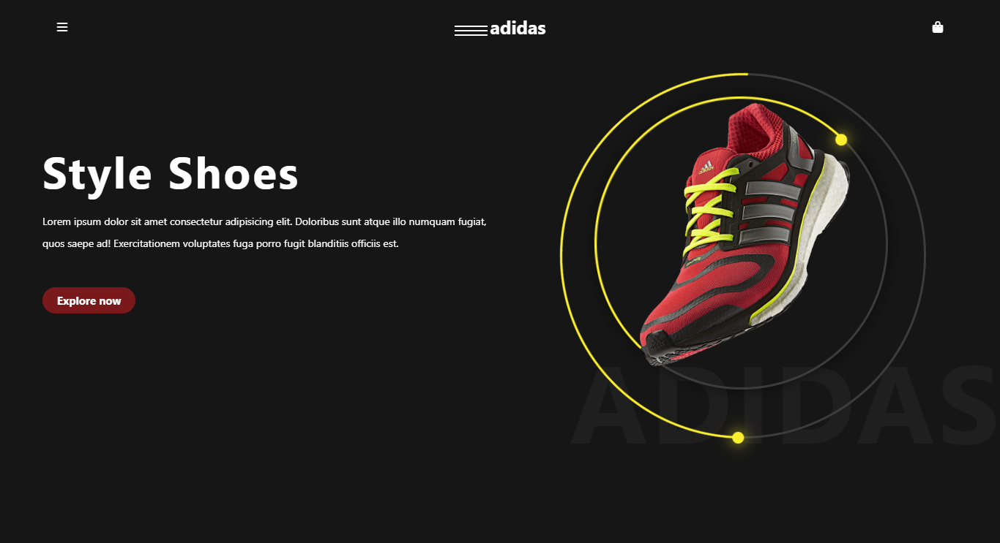

# StyleShoes Project

This project showcases a shoe store website created using CSS. In addition to its stylish design and user-friendly interface, it also features animations created using CSS.

## `Features`

- **CSS Design:** CSS is used for the visual design of the web page.

- **User-Friendly Interface:** A simple and understandable interface allows users to navigate comfortably.

- **Animations:** Animations are created using CSS for page transitions and elements.

---

## `Technologies Used`

- **HTML:** The structure of the web page is created using HTML.

- **CSS:** CSS is used for visual styling, layout adjustments, and animations.

---

## `Deploy`

- Visit the Web Page: Open [https://styleshoes-html-css.netlify.app/](https://styleshoes-html-css.netlify.app/) in your browser.

---

## `Screenshot`

